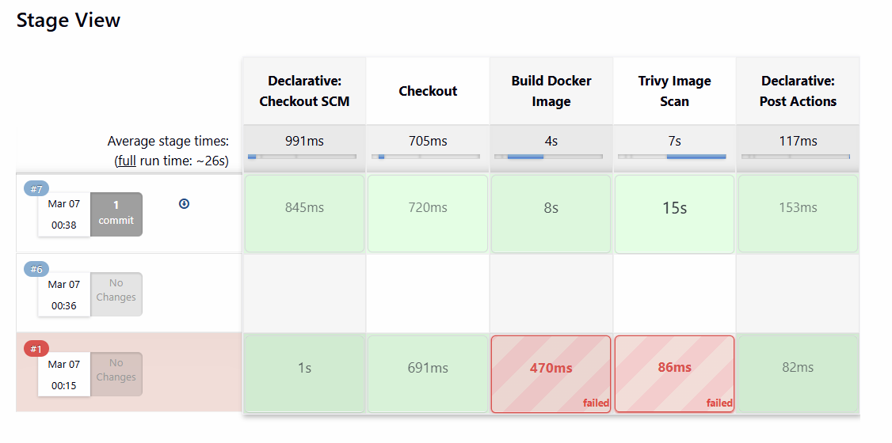
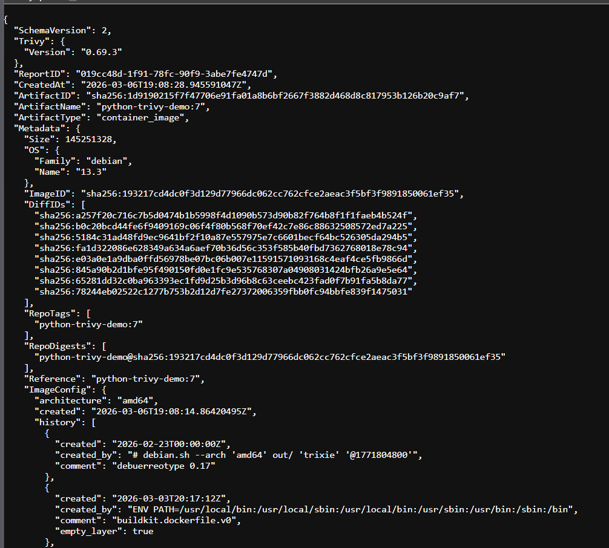
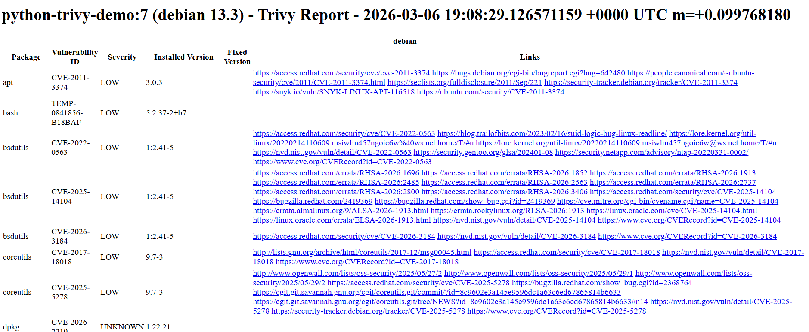

# 🔐 Trivy Jenkins Docker Project

> Automated Docker image vulnerability scanning using **Trivy** inside a **Jenkins declarative pipeline** — with JSON reports, HTML reports, and CycloneDX SBOM output.

---


## 📌 About

This project builds a **Python-based Docker image** and automatically scans it with Trivy as part of a Jenkins CI/CD pipeline. Every time code is pushed, the pipeline:

- Builds the Docker image (`python-trivy-demo`)
- Scans it with Trivy for OS & package vulnerabilities
- Generates a JSON report, HTML report, and CycloneDX SBOM
- Fails the build if HIGH or CRITICAL vulnerabilities are found (policy enforcement)

---

## ✅ Prerequisites

- AWS EC2 instance (Ubuntu 22.04, **t2.medium or higher**)
- Ports **22** (SSH) and **8080** (Jenkins) open in Security Group
- Basic Linux terminal knowledge

---

## ☁️ EC2 Setup & Installation

### 1️⃣ Install Docker

```bash
# Update system
sudo apt-get update -y

# Install dependencies
sudo apt-get install -y ca-certificates curl gnupg lsb-release

# Add Docker GPG key
sudo mkdir -p /etc/apt/keyrings
curl -fsSL https://download.docker.com/linux/ubuntu/gpg | \
  sudo gpg --dearmor -o /etc/apt/keyrings/docker.gpg

# Add Docker repository
echo \
  "deb [arch=$(dpkg --print-architecture) signed-by=/etc/apt/keyrings/docker.gpg] \
  https://download.docker.com/linux/ubuntu $(lsb_release -cs) stable" | \
  sudo tee /etc/apt/sources.list.d/docker.list > /dev/null

# Install Docker
sudo apt-get update -y
sudo apt-get install -y docker-ce docker-ce-cli containerd.io

# Start Docker & allow ubuntu user to run it
sudo systemctl start docker
sudo systemctl enable docker
sudo usermod -aG docker ubuntu
newgrp docker

# Verify
docker --version
```

---

### 2️⃣ Install Jenkins

```bash
# Install Java (required for Jenkins)
sudo apt-get install -y openjdk-17-jdk

# Add Jenkins repository
curl -fsSL https://pkg.jenkins.io/debian-stable/jenkins.io-2023.key | \
  sudo tee /usr/share/keyrings/jenkins-keyring.asc > /dev/null

echo "deb [signed-by=/usr/share/keyrings/jenkins-keyring.asc] \
  https://pkg.jenkins.io/debian-stable binary/" | \
  sudo tee /etc/apt/sources.list.d/jenkins.list > /dev/null

# Install Jenkins
sudo apt-get update -y
sudo apt-get install -y jenkins

# Start Jenkins
sudo systemctl start jenkins
sudo systemctl enable jenkins

# Verify
sudo systemctl status jenkins
```

🌐 Open Jenkins in browser: `http://<your-ec2-public-ip>:8080`

```bash
# Get the initial admin password
sudo cat /var/lib/jenkins/secrets/initialAdminPassword
```

> Complete the setup wizard → Install suggested plugins → Create admin user.

---

### 3️⃣ Allow Jenkins to Use Docker

```bash
# Add jenkins user to docker group
sudo usermod -aG docker jenkins

# Restart Jenkins to apply
sudo systemctl restart jenkins

# Verify
sudo -u jenkins docker ps
```

---

### 4️⃣ Install Trivy

```bash
# Add Trivy repository
sudo apt-get install -y wget apt-transport-https gnupg

wget -qO - https://aquasecurity.github.io/trivy-repo/deb/public.key | \
  sudo gpg --dearmor -o /usr/share/keyrings/trivy.gpg

echo "deb [signed-by=/usr/share/keyrings/trivy.gpg] \
  https://aquasecurity.github.io/trivy-repo/deb generic main" | \
  sudo tee /etc/apt/sources.list.d/trivy.list

# Install Trivy
sudo apt-get update -y
sudo apt-get install -y trivy

# Verify & update vulnerability DB
trivy --version
trivy image --download-db-only
```

---

### ✅ Verify Everything is Running

```bash
docker --version                      # Docker installed
trivy --version                       # Trivy installed
java -version                         # Java installed
sudo systemctl status jenkins         # Jenkins running
sudo systemctl status docker          # Docker running
```

---

## 🔧 Project Setup

### Clone the Repository

```bash
git clone https://github.com/Shubhamx18/trivy-labs.git
cd trivy-labs/trivy-jenkins-docker-project
```

### Configure Jenkins Pipeline

1. In Jenkins → **New Item → Pipeline**
2. Under **Pipeline Definition** → select **Pipeline script from SCM**
3. Set **SCM** to `Git` and enter your repository URL
4. Set **Script Path** to `trivy-jenkins-docker-project/Jenkinsfile`
5. Click **Save → Build Now**

---

## 🚀 Pipeline Overview

The pipeline has **5 stages**:

```
Checkout SCM  →  Checkout  →  Build Docker Image  →  Trivy Image Scan  →  Post Actions
```

| Stage | Description |
|-------|-------------|
| **Declarative: Checkout SCM** | Clones the repository |
| **Checkout** | Prepares the workspace |
| **Build Docker Image** | Builds `python-trivy-demo` Docker image |
| **Trivy Image Scan** | Scans image and generates reports |
| **Declarative: Post Actions** | Archives reports as Jenkins artifacts |

### Stage View



> ✅ Build **#7** passed in ~26s &nbsp;|&nbsp; ❌ Build **#1** failed — Trivy detected vulnerabilities (expected policy enforcement behavior)

---

## 📊 Scan Outputs

### JSON Report

Trivy outputs a full JSON report with image metadata and all detected CVEs.



| Field | Value |
|-------|-------|
| Image | `python-trivy-demo:7` |
| Trivy Version | `0.69.3` |
| OS | Debian 13.3 |
| Architecture | amd64 |
| Image Size | ~145 MB |

---

### HTML Vulnerability Report

Rich, browsable HTML report for easy review and sharing.



**Sample vulnerabilities found:**

| Package | CVE ID | Severity | Version |
|---------|--------|----------|---------|
| apt | CVE-2011-3374 | LOW | 3.0.3 |
| bash | TEMP-0841856 | LOW | 5.2.37-2+b7 |
| bsdutils | CVE-2022-0563 | LOW | 1:2.41-5 |
| bsdutils | CVE-2025-14104 | LOW | 1:2.41-5 |
| coreutils | CVE-2017-18018 | LOW | 9.7-3 |
| coreutils | CVE-2025-5278 | LOW | 9.7-3 |

---

### SBOM — CycloneDX Format

Software Bill of Materials listing every component inside the image.


| Field | Value |
|-------|-------|
| Format | CycloneDX 1.6 |
| Generated By | Trivy v0.69.3 (Aqua Security) |
| Component | `python-trivy-demo` (amd64) |

---

## 🖥️ Manual Trivy Commands

```bash
# Basic image scan
trivy image python-trivy-demo:7

# Scan with severity filter
trivy image --severity HIGH,CRITICAL python-trivy-demo:7

# Generate HTML report
trivy image --format template \
  --template "@contrib/html.tpl" \
  -o report.html python-trivy-demo:7

# Generate CycloneDX SBOM
trivy image --format cyclonedx \
  -o sbom.json python-trivy-demo:7

# Scan for secrets
trivy image --scanners secret python-trivy-demo:7
```

---

## 📚 Resources

- [Trivy Documentation](https://aquasecurity.github.io/trivy/)
- [CycloneDX SBOM Standard](https://cyclonedx.org/)
- [Jenkins Declarative Pipeline Syntax](https://www.jenkins.io/doc/book/pipeline/syntax/)
- [Trivy Cheat Sheet](../trivy_cheet_sheet.pdf)

---

## 👤 Author

**Shubhamx18** — [GitHub](https://github.com/Shubhamx18)

> Part of the [`trivy-labs`](https://github.com/Shubhamx18/trivy-labs) repository — a hands-on lab series for learning container security scanning with Trivy.
